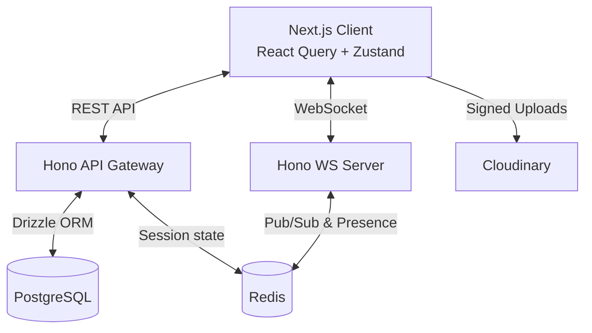
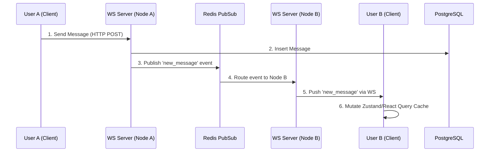

# SocialIO

A high-performance, real-time chat application built with a modern TypeScript stack. SocialIO features instant messaging, live presence indicators, typing indicators, image sharing, and deep WebSocket integration for a seamless user experience.


## ✨ Core Features

*   **Real-Time Messaging:** Sub-millisecond message delivery via native WebSockets.
*   **Live Presence & Typing:** "Active now" indicators, last-seen timestamps, and real-time typing indicators powered by Redis and Zustand.
*   **Optimistic UI:** Messages render instantly on the client before server confirmation, ensuring a snappy feel.
*   **Media Sharing:** Secure, signed image uploads directly to Cloudinary.
*   **Group Chats:** Multi-user conversation support with admin roles and customizable group avatars.
*   **Message Actions:** Edit messages inline, unsend (delete) messages, and add emoji reactions.

## 🏗️ Architecture

SocialIO is a monorepo managed by **Turborepo**. The frontend is a **Next.js** application that communicates with a **Hono** backend via both REST and WebSockets.

### System Overview



### Real-Time Message Flow

Our real-time flow is designed to avoid unnecessary database reads. The WebSocket server directly mutates the frontend's Zustand store and TanStack Query cache.



## 🚀 Tech Stack

*   **Frontend:** Next.js 15, React 19, TailwindCSS, shadcn/ui, TanStack Query, Zustand, Framer Motion.
*   **Backend:** Hono (Node.js Adapter), native `ws`, Better-Auth.
*   **Database:** PostgreSQL, Drizzle ORM.
*   **Infrastructure:** Redis (Pub/Sub & KV), Cloudinary (Media).

## 🛠️ Getting Started

### Prerequisites

*   Node.js (v20+)
*   pnpm (v9+)
*   PostgreSQL
*   Redis
*   Cloudinary Account

### Installation

1.  Clone the repository and install dependencies:

    ```bash
    pnpm install
    ```

2.  Environment Variables Setup:
    *   Copy `.env.example` to `.env` in `apps/server/` and configure your Postgres, Redis, and Cloudinary keys.
    *   Copy `.env.example` to `.env` in `apps/web/` and set your public API URLs.

3.  Apply the database schema:

    ```bash
    pnpm run db:push
    ```

4.  Start the development environment:

    ```bash
    pnpm run dev
    ```

The web application will be available at [http://localhost:3001](http://localhost:3001) and the API runs at [http://localhost:3000](http://localhost:3000).

## 📁 Project Structure

```text
socialIO/
├── apps/
│   ├── web/         # Next.js frontend application
│   └── server/      # Hono backend API & WebSocket server
├── packages/
│   ├── ui/          # Shared shadcn/ui components & Tailwind config
│   ├── auth/        # Better-Auth configuration
│   ├── db/          # Drizzle ORM schema, migrations, & Redis client
│   └── env/         # Zod-validated environment variables
└── docs/            # Architecture diagrams and planning documentation
```

## 📝 Available Scripts

*   `turbo dev`: Start all applications in development mode.
*   `turbo dev:web`: Start the Next.js frontend application.
*   `turbo dev:server`: Start the Hono backend API & WebSocket server.
*   `turbo check-types`: Check TypeScript types.
*   `turbo build`: Build all workspace packages and apps.
*   `turbo db:start`: Start a PostgreSQL database using Docker.
*   `turbo db:watch`: Watch the PostgreSQL database.
*   `turbo db:stop`: Stop the PostgreSQL database.
*   `turbo db:down`: Down the PostgreSQL database.
*   `turbo db:generate`: Generate Drizzle schema changes.
*   `turbo db:migrate`: Run database migrations.
*   `turbo db:push`: Push Drizzle schema changes to the PostgreSQL database.
*   `turbo db:studio`: Launch Drizzle Studio to explore your database.
*   `turbo infra:start`: Start the infrastructure services.
*   `turbo infra:stop`: Stop the infrastructure services.
*   `turbo infra:down`: Down the infrastructure services.
*   `turbo infra:watch`: Watch the infrastructure services.
*   `turbo redis:ping`: Ping the Redis server.
*   `turbo redis:cli:`: Launch the Redis CLI.